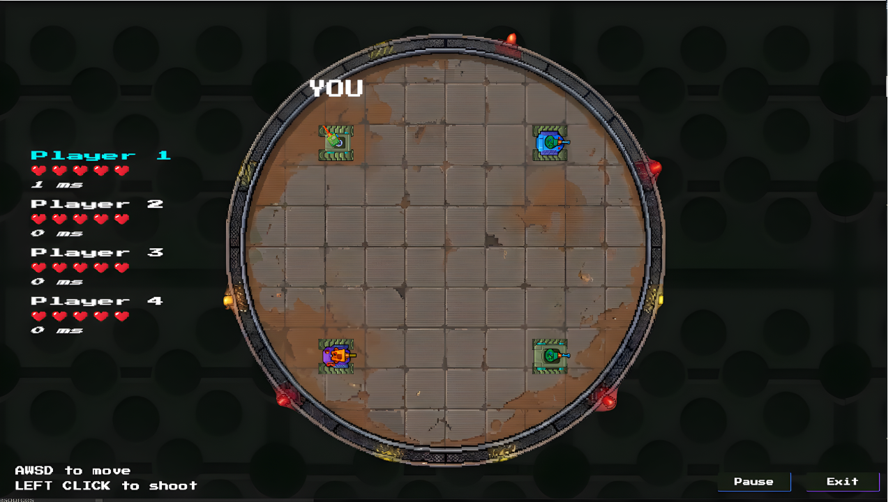
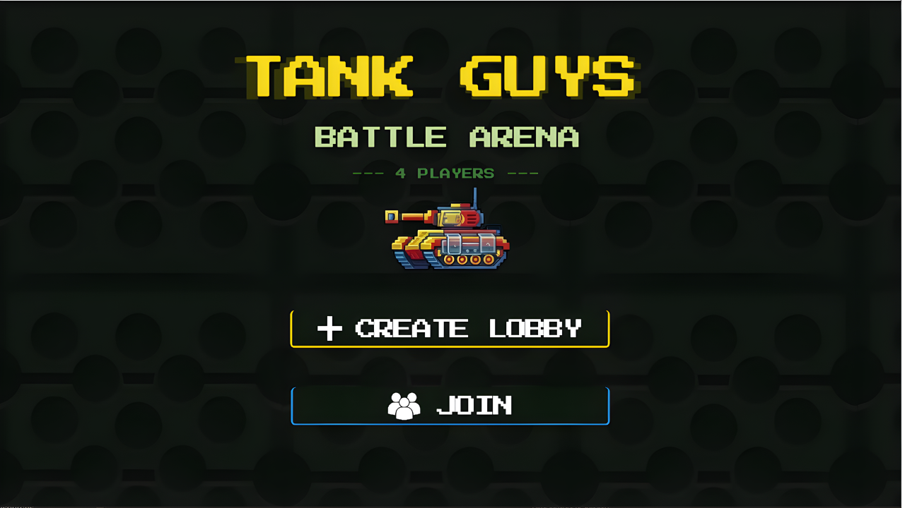
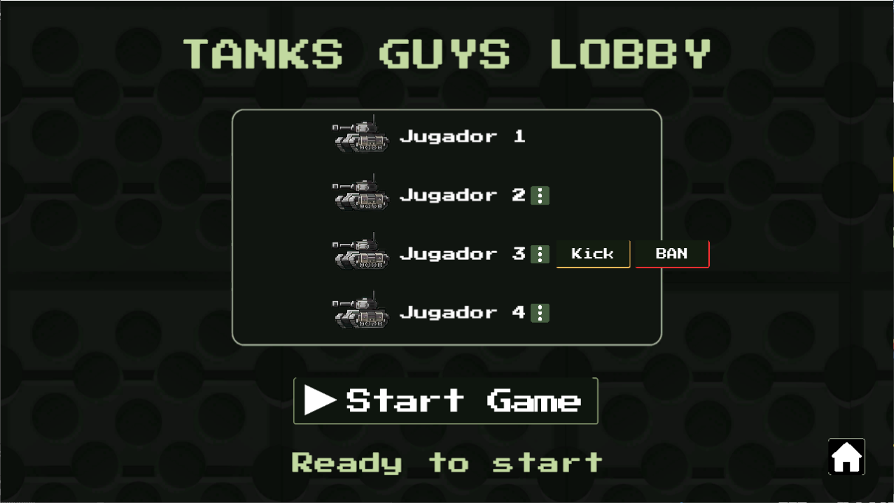
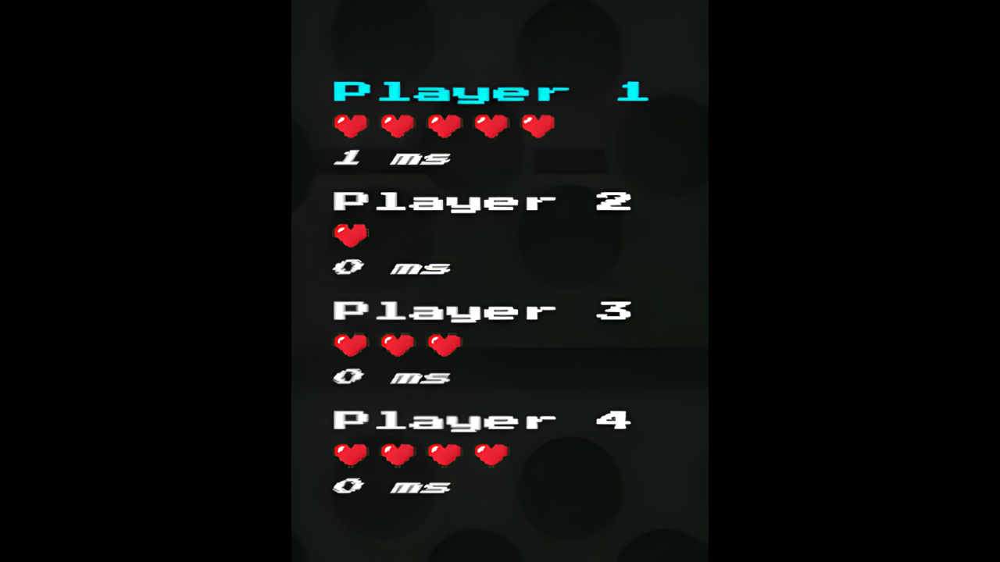
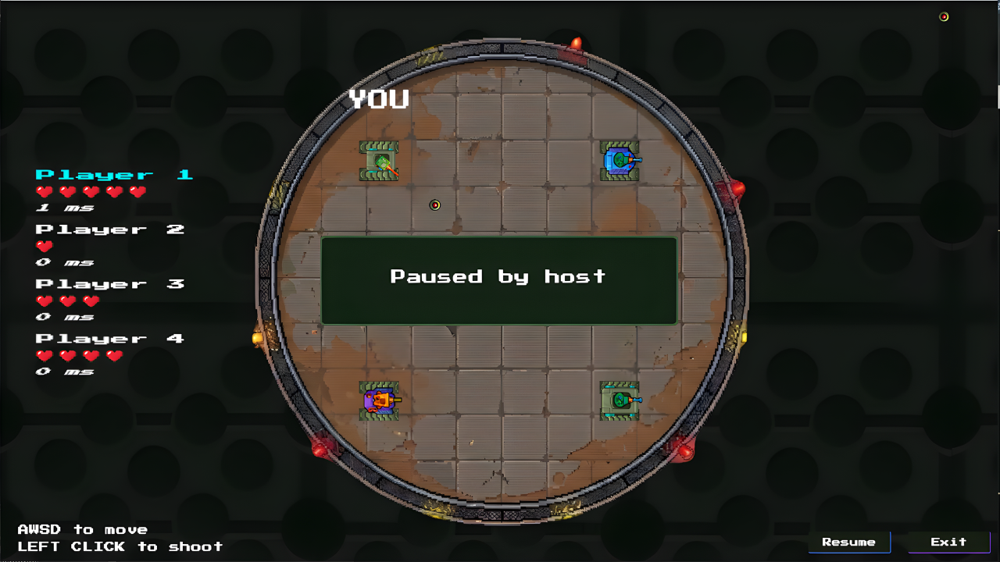
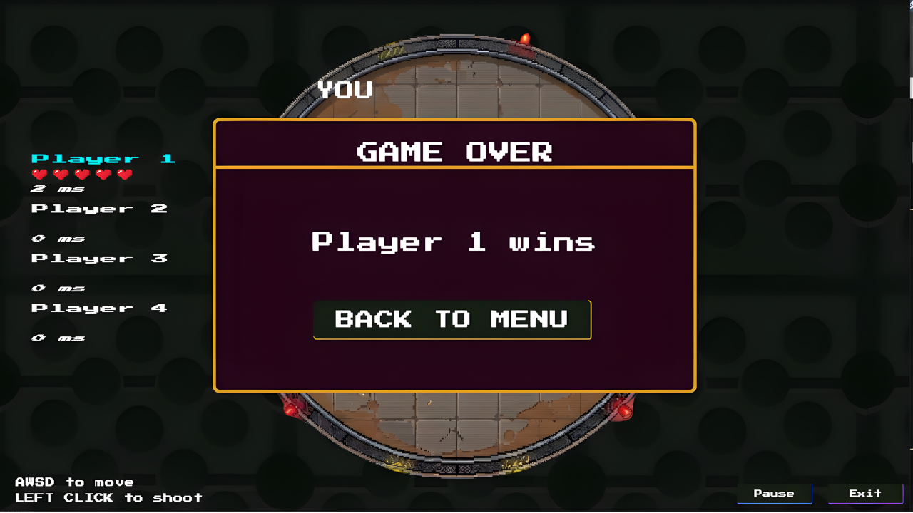

<a name="readme-top"></a>

[](https://unity.com/)
[](https://learn.microsoft.com/en-us/dotnet/csharp/)
[](https://dotnet.microsoft.com/)
[](https://www.microsoft.com/windows)
[](https://learn.microsoft.com/en-us/dotnet/api/system.net.sockets)
[](https://docs.unity3d.com/Manual/com.unity.textmeshpro.html)
[](.)

<br />

# Tank Guys Battle Arena — Juego Multijugador en Red

Juego de tanques en tiempo real con vista superior, desarrollado en Unity con arquitectura **Player-Host** sobre **TCP**. Un jugador actúa como servidor mientras los demás se conectan a él. El host también participa como jugador activo dentro de la partida; no existe servidor dedicado.

---

## Tabla de Contenidos

- [Descripción General](#descripción-general)
- [Requisitos Técnicos](#requisitos-técnicos)
- [Cómo Ejecutar el Sistema](#cómo-ejecutar-el-sistema)
- [Arquitectura de Red](#arquitectura-de-red)
- [Sincronización y Suavizado](#sincronización-y-suavizado)
- [Funcionalidades Implementadas](#funcionalidades-implementadas)
- [Funcionalidades Administrativas del Host](#funcionalidades-administrativas-del-host)
- [Flujo Completo del Juego](#flujo-completo-del-juego)
- [Estructura de Scripts](#estructura-de-scripts)
- [Errores y Limitaciones Conocidos](#errores-y-limitaciones-conocidos)

---

## Descripción General

**Tank Guys Battle Arena** es un juego multijugador de combate para 2 a 4 jugadores en red local. Cada jugador controla un tanque con movimiento en 8 direcciones y torreta orientable con el ratón. El objetivo es eliminar a todos los oponentes; el último jugador con vidas restantes gana la partida.

El modelo de red es **Player-Host**: quien crea la sala lanza un servidor TCP en su máquina y simultáneamente se conecta a él como cliente (jugador 1). Los demás jugadores se conectan usando la IP del host. No hay servidor dedicado; toda la lógica de juego corre dentro de la misma instancia de Unity del host.



---

## Requisitos Técnicos

| Requisito | Detalle |
|---|---|
| Motor | Unity 6000.3.8f1 |
| Lenguaje | C# (.NET Standard 2.1) |
| Protocolo de red | TCP (`System.Net.Sockets`) |
| Puerto por defecto | `7777` |
| Mínimo de jugadores | 2 |
| Máximo de jugadores | 4 |
| TextMeshPro | Requerido (disponible en Unity Package Manager) |
| Plataforma | Windows 10 / 11 |

> Todos los jugadores deben estar en la **misma red local (LAN)**, o el host debe exponer el puerto `7777` mediante reenvío de puertos para conexiones externas.

---

## Cómo Ejecutar el Sistema

### Host — Crear Sala

1. Abrir el proyecto en Unity 6000.3.8f1 y ejecutar la build (o presionar Play en el editor).
2. En el menú principal, hacer clic en **"Crear Sala"**.
3. La aplicación iniciará un servidor TCP en el puerto `7777` y se conectará automáticamente como jugador 1.
4. Compartir la **dirección IP local** con los demás jugadores (ejemplo: `192.168.1.X`).
5. Una vez que al menos 2 jugadores estén en el lobby, el host puede presionar **"Iniciar Partida"**.



### Cliente — Unirse a una Sala

1. Abrir la build en otra máquina (o en otra instancia del editor).
2. En el menú principal, hacer clic en **"Unirse a Sala"**.
3. El cliente intentará conectarse a `127.0.0.1:7777` por defecto.

> **Importante:** Para conectarse a un host en otra máquina, modificar la IP en `TcpTransport.cs`, dentro del método `Start()`, reemplazando `"127.0.0.1"` por la IP del host.

### Controles en Partida

| Acción | Control |
|---|---|
| Mover el tanque | `W A S D` / Flechas del teclado |
| Apuntar la torreta | Cursor del ratón |
| Disparar | Clic izquierdo |
| Pausar partida *(solo host)* | Tecla `P` o botón Pausa en la UI |

---

## Arquitectura de Red

Se implementó una arquitectura **Player-Host** sin servidores dedicados. El host ejecuta simultáneamente un servidor TCP y un cliente que se conecta a ese mismo servidor.

```
[Máquina del Host]
  ├── NetworkServer  →  TcpListener en puerto 7777
  └── NetworkClient  →  Se conecta a localhost:7777 (Jugador 1)

[Máquina Cliente N]
  └── NetworkClient  →  Se conecta a IP_del_host:7777
```

### Protocolo de Comunicación

Los mensajes viajan como **cadenas JSON terminadas en `\n`** sobre flujos TCP persistentes. Cada mensaje se empaqueta en un `MessageWrapper` que contiene:

- `type` — valor del enum `MessageType` que identifica el tipo de mensaje.
- `json` — cuerpo del mensaje serializado con `JsonUtility`.

**Flujo de conexión:**

1. El cliente abre una conexión TCP y envía `HelloMessage`.
2. El servidor asigna un ID único y responde con `AssignIdMessage`.
3. El servidor transmite `PlayerListMessage` a todos los conectados.
4. Durante la partida, los clientes envían inputs (`MoveMessage`, `ShootMessage`, etc.).
5. El servidor ejecuta la lógica, actualiza el estado y difunde el resultado a todos.

### Gestión de Conexiones

`ConnectionManager` mantiene un diccionario `TcpClient → int (playerId)` con una cola de IDs liberados para reutilización. `ServerConnectionService` valida cada nueva conexión: verifica si la IP está baneada, si la partida ya comenzó y si se alcanzó el límite de jugadores, enviando un `ConnectionRejectedMessage` con motivo en caso de rechazo.

### Hilo Principal de Unity

Las operaciones TCP corren en hilos de fondo, pero la API de Unity solo puede invocarse desde el hilo principal. Para esto se usa `UnityMainThreadDispatcher`: una cola thread-safe de `Action` que se ejecuta frame a frame en `Update()`, garantizando que toda modificación de GameObjects ocurra de forma segura.

---

## Sincronización y Suavizado

### Interpolación de Posición — `PlayerMovementInterpolator`

Para evitar que los jugadores remotos teletransporten entre actualizaciones de red, se aplica **interpolación lineal (Lerp)** sobre las posiciones recibidas:

- Las posiciones entrantes se almacenan en un buffer circular por jugador (máximo 5 entradas).
- Cada frame, la posición visual se interpola desde el valor actual hacia el objetivo más antiguo del buffer con `Vector3.Lerp(current, buffered, 10 * Time.deltaTime)`.
- Esto introduce un pequeño retraso visual controlado a cambio de movimiento continuo y fluido.

### Suavizado de Rotación

Tanto `PlayerLocalController` como `PlayerRemoteController` aplican `Quaternion.Lerp` para la rotación del casco y la torreta, eliminando giros abruptos cuando se reciben actualizaciones de dirección por red.

### Limitación de Frecuencia de Envío

`PlayerInputController` envía mensajes de movimiento a **30 Hz fijos** (`sendInterval = 1/30 s`), evitando saturar la red y haciendo predecible la carga del servidor.

### Autoridad del Servidor

El servidor (`GameLogic`) es la fuente de verdad para posiciones, vidas y estado de los jugadores. Los clientes nunca modifican el estado unilateralmente: envían inputs y el servidor difunde el resultado. Esto previene inconsistencias entre clientes y facilita la validación de acciones.

---

## Funcionalidades Implementadas

### Conectividad
- Soporte de 2 a 4 jugadores simultáneos.
- Conexiones estables durante eventos de ingreso y abandono de jugadores.
- Los jugadores pueden desconectarse en cualquier momento sin afectar al host ni a los demás clientes.
- El juego no requiere reiniciarse cuando un jugador abandona la sesión.

### Sincronización
- Sincronización en tiempo real de posición, dirección de movimiento y ángulo de torreta.
- Interpolación de posición para suavizar el movimiento de jugadores remotos.
- Suavizado de rotación mediante `Quaternion.Lerp`.
- Cadencia de envío de input fija a 30 Hz.

### Gestión de Estado
- `GamePhase` controla las fases: `Lobby → Playing → Paused → Ended`.
- `GameState` centraliza el mapa de jugadores activos, la fase actual y el ID del ganador.
- `PlayerData` almacena posición, vidas, estado (`Alive`/`Spectator`) y rotaciones por jugador.

### Flujo Completo
- **Lobby:** sala de espera con lista de jugadores en vivo; el host inicia la partida al haber dos jugadores o más.
- **Partida:** combate en arena circular con tanques y proyectiles, cada jugador comienza con 5 vidas.
- **Fin de partida:** cuando solo queda un jugador vivo se muestra la pantalla de ganador con `Time.timeScale = 0`.
- **Reinicio:** los jugadores pueden volver al menú principal e iniciar una nueva sesión.

---

## Funcionalidades Administrativas del Host

Se implementaron **4 de las funcionalidades administrativas** requeridas. Todas están disponibles únicamente para el jugador que creó la sala.



### Expulsar Jugador (Kick)

El host puede expulsar a cualquier jugador desde el lobby. Al presionar el botón de expulsión junto al nombre del jugador, se envía un `KickRequestMessage` al servidor. El servidor verifica que el remitente sea el host, envía un `KickedMessage` con motivo al cliente objetivo y cierra su conexión.

### Banear Jugador por IP (Ban)

Similar al kick, pero la IP del cliente queda registrada en `ServerAdminService.bannedIPs`. Cualquier intento futuro de conexión desde esa IP es rechazado con `ConnectionRejectedMessage` indicando el motivo del baneo. El baneo persiste mientras el servidor esté activo.

### Visualizar Ping / Latencia

`PingSystem` envía un `PingMessage` con timestamp cada segundo. El servidor responde con `PongMessage` al mismo cliente. Al recibir el pong, el cliente calcula el RTT (Round-Trip Time) en milisegundos y lo difunde a todos mediante `PingReportMessage`. El HUD en partida muestra el ping actualizado de cada jugador.



### Pausar la Partida como Administrador

El host puede pausar y reanudar la partida mediante el botón en pantalla o la tecla `P`. Al recibir el `PauseMessage`, el servidor valida que el remitente sea el host y lo difunde a todos. Cada cliente ajusta `Time.timeScale` (0 pausado, 1 activo) y actualiza la UI correspondiente. Los clientes no pueden pausar la partida.



---

## Flujo Completo del Juego

```
[Menú Principal]
       │
       ├── Crear Sala ──────► [Lobby como Host]
       └── Unirse a Sala ───► [Lobby como Cliente]
                                      │
                             (≥ 2 jugadores conectados)
                                      │
                              Host presiona Iniciar
                                      │
                           [StartGameMessage → todos]
                                      │
                             [Escena de Partida]
                                      │
                        Jugadores combaten en la arena
                        (movimiento, disparo, daño)
                                      │
                        Solo queda 1 jugador con vida
                                      │
                       [GameEndMessage → todos]
                       [Pantalla de Ganador]
                                      │
                          Botón "Salir al Menú"
                                      │
                          [Nueva sesión disponible]
```



**Condiciones especiales durante la partida:**
- Si un jugador se desconecta, es eliminado del `GameState` y se verifica automáticamente si queda un ganador.
- Si el host se desconecta, todos los clientes reciben el evento `OnDisconnected` y regresan al menú principal.
- Un jugador con `PlayerStatus.Spectator` (vidas agotadas) es removido visualmente pero la sesión continúa para los demás.

---

## Estructura de Scripts

```
Scripts/
├── Core/
│   └── UnityMainThreadDispatcher      # Cola thread-safe para ejecutar acciones en el hilo principal
│
├── Gameplay/
│   ├── Arena/
│   │   └── SpawnManager               # Asigna posiciones de aparición según el ID del jugador
│   ├── Combat/
│   │   ├── ClientShootHandler         # Instancia proyectiles al recibir el evento de disparo
│   │   ├── DamageMessage              # Mensaje: ID del jugador que recibe daño
│   │   ├── Projectile                 # Movimiento del proyectil y detección de impacto
│   │   ├── ProjectileSpawner          # Instancia prefabs de proyectiles en el punto de disparo
│   │   ├── ShootMessage               # Mensaje: dirección del disparo (dirX, dirY)
│   │   └── ShootMessageHandler        # Procesa mensajes de disparo recibidos en el cliente
│   ├── Core/
│   │   ├── GameEndUIController        # Muestra la pantalla de ganador al terminar la partida
│   │   ├── GameLogic                  # Reglas del juego y transiciones de estado (lado servidor)
│   │   ├── GameManager                # MonoBehaviour central; gestiona cambios de escena
│   │   ├── HostPauseController        # Botón de pausa visible únicamente para el host
│   │   └── PauseUIController          # Panel de pausa visible para todos los jugadores
│   ├── Player/
│   │   ├── Core/
│   │   │   ├── PlayerLabel            # Etiqueta "YOU" flotante sobre el jugador local
│   │   │   ├── PlayerLocalController  # Procesa input local y lo envía a la red
│   │   │   ├── PlayerManager          # Crea, actualiza y elimina GameObjects de jugadores
│   │   │   ├── PlayerMovementInterpolator # Suavizado de posición por interpolación lineal
│   │   │   ├── PlayerNetworkSender    # Centraliza envíos de dirección, torreta y disparo
│   │   │   ├── PlayerRemoteController # Suavizado de rotación para jugadores remotos
│   │   │   └── PlayerSpawner          # Instancia prefabs de jugadores en sus puntos de aparición
│   │   ├── Data/
│   │   │   ├── PlayerData             # Posición, vidas, estado y rotaciones de cada jugador
│   │   │   ├── PlayerDataExtensions   # Métodos IsAlive() e IsSpectator()
│   │   │   ├── PlayerStatus           # Enum: Alive, Spectator
│   │   │   └── PlayerTag              # MonoBehaviour que expone el PlayerId en el GameObject
│   │   ├── Input/
│   │   │   ├── PauseInputController   # Detecta tecla P para pausar (solo host)
│   │   │   └── PlayerInputController  # Captura movimiento y disparo a 30 Hz y los envía
│   │   └── Network/
│   │       ├── TankDirectionMessage   # Mensaje: índice de dirección del casco (0–7)
│   │       ├── TankDirectionMessageHandler
│   │       ├── TurretRotationMessage  # Mensaje: ángulo de la torreta en grados
│   │       └── TurretRotationMessageHandler
│   ├── State/
│   │   ├── GamePhase                  # Enum: Lobby, Playing, Paused, Ended
│   │   ├── GameStateExtensions        # AliveCount() e IsGameplayBlocked()
│   │   ├── PlayerStateMessage         # Mensaje: vidas actuales y estado del jugador
│   │   └── PlayerStateMessageHandler  # Aplica cambios de estado recibidos al GameState local
│   └── Systems/
│       └── PingSystem                 # Mide y distribuye la latencia de cada jugador
│
├── Network/
│   ├── Client/
│   │   ├── GameClient                 # Cliente de juego; registra handlers y expone eventos
│   │   ├── GameSnapshotProcessor      # Aplica snapshots de estado al GameState local
│   │   └── MessageDispatcher          # Enruta mensajes entrantes a sus IMessageHandler
│   ├── Core/
│   │   └── ConnectionManager          # Mapeo TcpClient ↔ playerId con reutilización de IDs
│   ├── Handlers/
│   │   ├── Base/
│   │   │   └── IMessageHandler        # Interfaz: Handle(NetMessage, GameClient)
│   │   ├── Client/                    # Un handler por cada tipo de mensaje que recibe el cliente
│   │   │   ├── AssignIdMessageHandler
│   │   │   ├── BannedMessageHandler
│   │   │   ├── ConnectionRejectedHandler
│   │   │   ├── GameEndMessageHandler
│   │   │   ├── KickedMessageHandler
│   │   │   ├── MoveMessageHandler
│   │   │   ├── PauseMessageHandler
│   │   │   ├── PingReportMessageHandler
│   │   │   ├── PlayerListMessageHandler
│   │   │   ├── PongMessageHandler
│   │   │   └── StartGameMessageHandler
│   │   └── Server/
│   │       └── IServerMessageHandler  # Interfaz genérica para handlers del lado servidor
│   ├── Runtime/
│   │   ├── HostNetwork                # Orquesta GameServer + GameClient en la misma instancia
│   │   └── NetworkBootstrap           # MonoBehaviour de entrada; decide si crear host o cliente
│   ├── Server/
│   │   ├── GameServer                 # Ensambla servidor TCP, lógica de juego y procesador
│   │   ├── ServerAdminService         # Gestiona kick, ban y registro de IPs baneadas
│   │   ├── ServerConnectionService    # Valida y registra nuevas conexiones entrantes
│   │   ├── ServerMessageProcessor     # Despacha mensajes del servidor según su tipo
│   │   └── ServerMessageSender        # Serializa y envía/difunde mensajes desde el servidor
│   ├── Shared/
│   │   ├── Messages/
│   │   │   ├── Core/                  # AssignIdMessage, HelloMessage, NetMessage, PlayerListMessage
│   │   │   ├── Gameplay/              # GameEndMessage, MoveMessage, PauseMessage, StartGameMessage
│   │   │   ├── Request/               # BanRequestMessage, KickRequestMessage
│   │   │   ├── Responses/             # BannedMessage, ConnectionRejectedMessage, KickedMessage
│   │   │   └── System/                # PingMessage, PingReportMessage, PongMessage
│   │   └── State/
│   │       ├── GameSnapshot           # Snapshot completo del estado del juego
│   │       ├── GameState              # Estado central: jugadores, fase, ganador
│   │       └── PlayerSnapshot         # Posición puntual serializable de un jugador
│   └── Transport/
│       ├── Common/
│       │   ├── MessageRouter          # Deserializa JSON y lo enruta al handler registrado
│       │   ├── MessageType            # Enum con todos los tipos de mensaje del sistema
│       │   └── MessageWrapper         # Envoltorio de transporte: type + json payload
│       ├── Interfaces/
│       │   └── ITransport             # Interfaz: Send, Start, Stop, OnMessage, OnDisconnected
│       ├── Systems/
│       │   ├── TcpClientRuntime       # Gestiona conexión, envío, recepción y desconexión TCP
│       │   └── TcpServerRuntime       # Puente entre NetworkServer y ServerMessageProcessor
│       └── TCP/
│           ├── INetworkClient         # Interfaz de cliente TCP
│           ├── INetworkServer         # Interfaz de servidor TCP
│           ├── NetworkClient          # Cliente TCP: conecta, envía, bucle de recepción
│           ├── NetworkServer          # Servidor TCP: escucha, acepta y gestiona clientes
│           └── TcpTransport           # Implementa ITransport usando TcpClientRuntime
│
└── UI/
    ├── Common/
    │   ├── ErrorPanelUI               # Panel de error reutilizable con mensaje y botón OK
    │   └── ExitButtonUI               # Botón para regresar al menú principal
    ├── Game/
    │   ├── InGamePlayerListUI         # HUD: lista jugadores con vidas y ping en tiempo real
    │   └── PlayerRowInGameUI          # Fila individual: nombre, corazones y latencia
    ├── Lobby/
    │   ├── LobbyUI                    # Sala de espera: lista jugadores, estado y botón iniciar
    │   └── PlayerRowUI                # Fila de jugador con opciones de kick y ban (solo host)
    └── Menu/
        └── MainMenuUI                 # Menú principal: botones Crear/Unirse y mensajes de estado
```

---

## Errores y Limitaciones Conocidos

| Problema | Descripción |
|---|---|
| **IP hardcodeada** | Los clientes se conectan a `127.0.0.1` por defecto. Para jugar en red real se debe editar `TcpTransport.cs` manualmente antes de compilar. No existe campo de IP en la UI. |
| **Sin transferencia de host** | Si el host cierra la aplicación todos los clientes son desconectados. No hay mecanismo para transferir el rol de host a otro jugador. |
| **Proyectiles solo locales** | Los proyectiles se instancian localmente en cada cliente al recibir `ShootMessage`; no son objetos de red sincronizados. Puede haber pequeñas discrepancias visuales con latencia alta. |
| **Sin reconexión** | Si un cliente pierde la conexión por error de red (sin kick ni ban), no puede volver a unirse a la misma sesión activa. |
| **Buffer de lectura fijo** | El buffer TCP está fijo en 1024 bytes. Mensajes que excedan ese tamaño en un solo chunk podrían fragmentarse. En la práctica los mensajes son pequeños y no se ha presentado este problema. |
| **Sin cifrado ni autenticación** | Las comunicaciones no están cifradas. No se recomienda exponer el puerto `7777` en redes públicas. |
| **Máximo de jugadores no configurable** | El límite de 4 jugadores está validado en `ServerConnectionService` pero no es ajustable desde la interfaz. |

<p align="right"><a href="#readme-top">Volver al inicio</a></p>